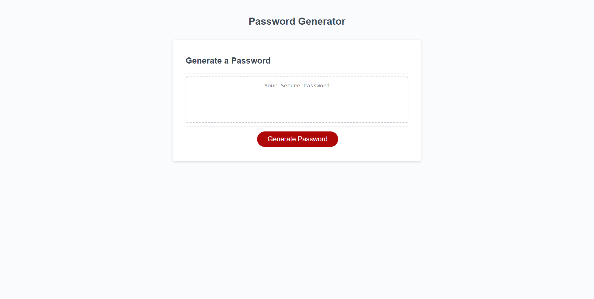

# Password Generator

## About this project?

This project is about creating a password generator which includes elements of HTML, CSS and JavaScript

The requirements of the code is as follows:

- When the user clicks generate password a series of prompts appear on screen, where the user must pick a password length between 8 - 128 characters

- Then they will be given a choice to pick between different criteria they would like to include.

- The user has the option between picking uppercase, lowercase, symbols and numbers for there password. They MUST choose atleast one of these for their password.

- When the conditions are met password will be generated!

# Links to URL & GitHub Repo

Link to GitHub Repo (Dev Branch) [link](https://github.com/TanveerBassi/password-generator/tree/dev "GitHub Repo Link").

Link to URL [link](https://tanveerbassi.github.io/password-generator/ "Live URL").

# Screenshot of the project

